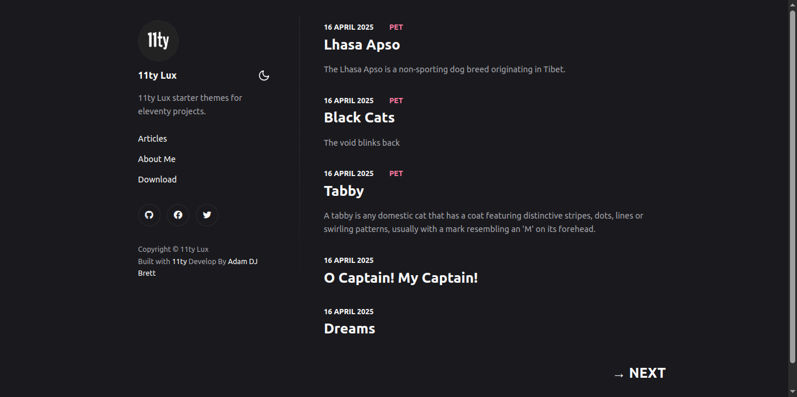

# 11ty-lux



A starter project for eleventy

If you need help or have project , contact me :

+ info@adamdjbrett.com
+ www.adamdjbrett.com

## TO DO
1. update metadata.yaml
2. learn markdown
3. update /content/ folder
4. add yourself to humans.txt
5. blog posts all get named with hypens and no spaces .md for example ```awesome-thoughts.md``` the file name becomes the slug so the slug becomes /awesome-thoughts/ you can change this functionality via the frontmatter if you want but that can be a pain
6. have fun
7. whenever you push your site to github it will autodeploy to cloudflare.
